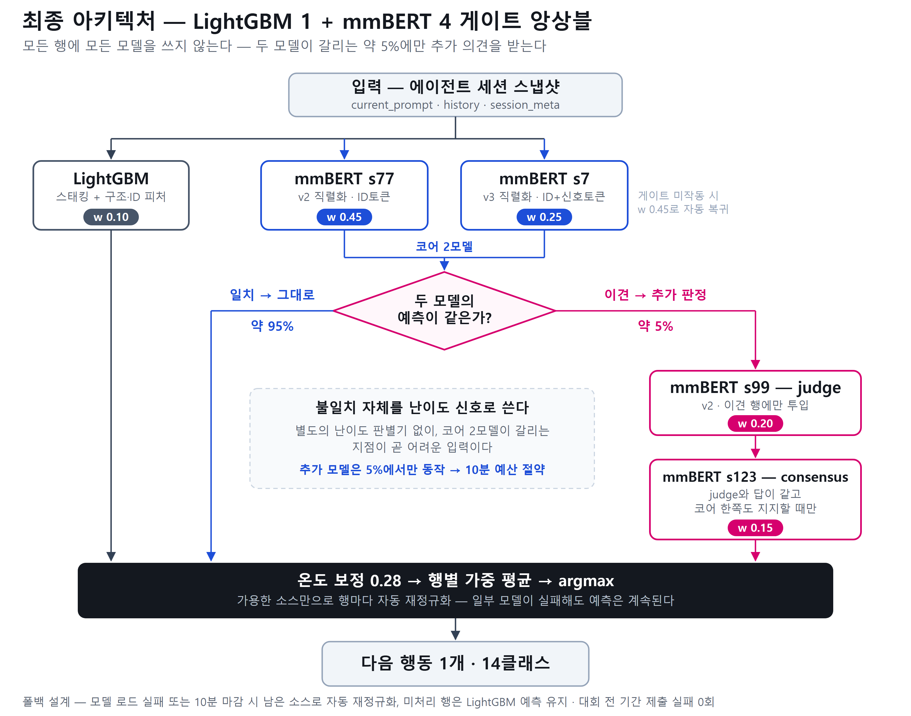

# AI·SW 중심대학 디지털 경진대회

2026 AI·SW중심대학 디지털 경진대회 AI부문 — **코딩 에이전트의 다음 행동 예측**
(14클래스 분류) 과제의 최종 자료입니다. 대회는 종료되었고, 이 저장소는 최종 결과와
전 과정의 기록을 보존합니다.

## 결과

| 항목 | 내용 |
|---|---|
| 수상 | **후원기업상** |
| Private Macro-F1 | **0.7967670316** |
| 최고점 제출물 | `g4_c15.zip` (893.6 MiB) |
| 모델 | LightGBM 1 + mmBERT 4 게이트 앙상블 |
| 평가 환경 | T4 16GB, 3 vCPU, 추론 10분, ZIP 1GB 이하, 오프라인 |

베이스라인(`current_prompt`만 사용한 TF-IDF + LogReg) 검증 0.4309에서 출발해
최종 리더보드 0.79677까지 개선했습니다. 이 대회는 private 분할이 없어
**Public Score가 전체 테스트 100% 채점이자 최종 점수**입니다.

성장 궤적: `0.7414 → 0.7559 → 0.7903 → 0.79677`

## 무엇이 개선을 만들었나

| 기여 | 효과 |
|---|---|
| 행동 이력·메타를 토큰으로 주입 | 검증 0.437 → 0.611 |
| 백본 교체 (XLM-R → mmBERT) | 단독 **+0.021** — 단일 변경 최대 |
| **ID토큰 직렬화** | LB **+0.011** — 단일 기법 최대 |
| **선택적 게이트 앙상블** | 0.79596 → 0.79677 (계단식) |

두 핵심 기여의 상세 설명은 [아키텍처 그림 부분별 해설](docs/presentation/아키텍처_해설.md)에 있습니다.

## 최종 아키텍처



모든 행에 모든 모델을 쓰지 않습니다. 직렬화가 다른 코어 2모델이 합의하면 그대로
채택하고(약 95%), **갈리는 약 5%의 행에만** judge와 consensus 모델을 투입합니다.
모델 간 불일치 자체를 난이도 신호로 쓰기 때문에 별도의 난이도 판별기가 필요 없고,
추가 모델이 5%에서만 도는 덕분에 서버 10분 예산도 절약됩니다.

| 소스 | 직렬화 | 가중치 | 언제 도는가 |
|---|---|---|---|
| LightGBM | — | `0.10` | 항상 (폴백 기준선) |
| mmBERT seed77 | v2 (ID토큰) | `0.45` | 항상 |
| mmBERT seed7 | v3 (ID+신호토큰) | `0.25` | 항상 (게이트 미개방 행에서는 `0.45`) |
| mmBERT seed99 | v2 | `0.20` | 코어 이견 행 (약 5%) — judge |
| mmBERT seed123 | v3 | `0.15` | 이견 + 합의 통과 행 — consensus |

Transformer temperature `0.28`. 세부 파라미터는
[`source/final_params.json`](source/final_params.json)에 있습니다.

**폴백 설계** — 모델이 실패하거나 10분 마감에 걸려도 남은 소스만으로 행별 자동
재정규화되어 예측이 계속됩니다. 대회 전 기간 제출 실패 **0회**.

## 제약 엔지니어링 (1GB · 10분)

| 기법 | 효과 |
|---|---|
| 사용 어휘 3.8%만 유지 | 모델당 614MB → 273MB, 예측 파리티 100% 검증 |
| FP16 저장·추론 | 용량 절반, T4 최적 |
| 길이 버킷팅 배치 | 추론 4.2배 가속 |

최종 zip **885MB** (제한 1GB), 트랜스포머 4개 + LightGBM 포함.

## 저장소 구성

```text
.
├── README.md
├── MODEL_CARD.md            # 최종 모델 요약
├── SHA256SUMS.txt           # 배포 자산 체크섬
├── source/                  # 최종 학습·추론·조립 코드 (재현 가능)
│   ├── run_all_train.py     #   전체 파이프라인
│   ├── final_params.json    #   앙상블 하이퍼파라미터
│   └── final_inference/     #   Private 기록 제출물의 추론 코드 사본
├── docs/
│   ├── strategy/            # 전략과 날짜별 실험 로그 전체
│   ├── presentation/        # 발표 자료·대본·공부 노트·포스터·다이어그램
│   └── experiments/         # 대회 규정과 추가 백본 실험 기록
└── artifacts/
    └── code_submission.zip  # 학습 코드 제출본
```

## 재현

대회 제공 `train.jsonl`, `train_labels.csv`를 `source/data/`에 배치한 후 실행합니다.

```bash
cd source
python run_all_train.py
```

RTX 4060 기준 약 21시간(LightGBM 30분 + 트랜스포머 4개 × 약 5시간)이 필요합니다.
모든 시드와 라이브러리 버전이 고정되어 있으며, 학습 코드가 추론 코드에서 피처 함수를
직접 import 하므로 학습·추론 간 피처 불일치가 원천적으로 불가능합니다.

**외부 데이터는 일절 사용하지 않았습니다.** 학습은 제공된 train 70,000건만 사용했고,
사전학습 백본은 공개 가중치(`jhu-clsp/mmBERT-base`)입니다. 대회 데이터는 재배포하지 않습니다.

## 최종 모델 파일

893.6 MiB의 `g4_c15.zip`은 GitHub의 파일당 100MB 제한 때문에 저장소에 포함할 수 없어
`.gitignore`로 제외되어 있습니다. 배포하려면 **Releases**에 첨부하세요 (Release 자산은 2GB까지 허용).

```
저장소 → Releases → Draft a new release → 태그 생성 →
GitHub_최종본/release_assets/g4_c15.zip 첨부
```

SHA256: `8e2853cbce59f47bc269788ced80497615fd3da829ceea55a89880df3b8df3b0`

## 주요 문서

**결과와 방법**
- [모델 카드](MODEL_CARD.md) — 최종 모델 요약과 한계
- [아키텍처 그림 부분별 해설](docs/presentation/아키텍처_해설.md) — 다이어그램 ①~⑩ 설명
- [학습 코드 README](source/README.md) — 환경, 실행 순서, 재현성 노트

**전 과정의 기록**
- [대회 전략 전체 기록](docs/strategy/대회_전략.md) — 모든 실험의 날짜별 로그 (채택·기각 사유 포함)
- [대회 정리](docs/strategy/대회_정리.md) — 규정·데이터 구조·평가 환경

**발표 자료**
- [발표 자료](docs/presentation/발표_정리.md) — 슬라이드 14장 구성
- [발표 대본](docs/presentation/발표_대본.md) — 10분 시간 배분 포함
- [발표 공부 노트](docs/presentation/발표_공부노트.md) — 용어 사전부터 Q&A까지
  ([인쇄용 PDF](docs/presentation/발표_공부노트.pdf), A4 28쪽)
- [포스터 세션 자료](docs/presentation/포스터_초안.md)

## 실패로 기록한 것

검증 체계가 조기에 잡아내 최종 모델에서 배제한 시도들입니다. 상세 근거는
[대회 전략 기록](docs/strategy/대회_전략.md)에 있습니다.

| 시도 | 결과 | 교훈 |
|---|---|---|
| 클래스별 scale 후처리 | 검증 ↑, LB ↓ | 검증 과적합은 LB 프로브로만 검출 |
| 모델 수프 | 0.7645 붕괴 | 시드가 다르면 다른 basin — 가중치 평균 불가 |
| 41만 조합 전수 탐색 | 로컬 0.812 → LB 0.795 | 소표본 조합 탐색은 강한 과적합 (상관 0.20) |
| 학습형 메타 게이트 | LB −0.005 | 전체 학습 확률 기반 OOF에도 누수 잔존 |

## 한계

- **ID토큰은 본 데이터의 생성 방식에 의존하는 피처**라 실제 서비스에는 일반화되지 않습니다.
- 14개 클래스는 이 대회가 정의한 도구 집합입니다.
- 재사용 가능한 것은 모델이 아니라 **게이트 앙상블 구조, 폴백 설계, 검증 방법론**입니다.
  특히 게이트 앙상블은 캐스케이드 추론 그 자체라, 어려운 입력에만 큰 모델을 호출하는
  실서비스 비용 최적화에 그대로 적용됩니다.

---

별도 라이선스는 지정하지 않았으며, 대회 데이터와 사전학습 모델은 원래 이용 조건을 따릅니다.
